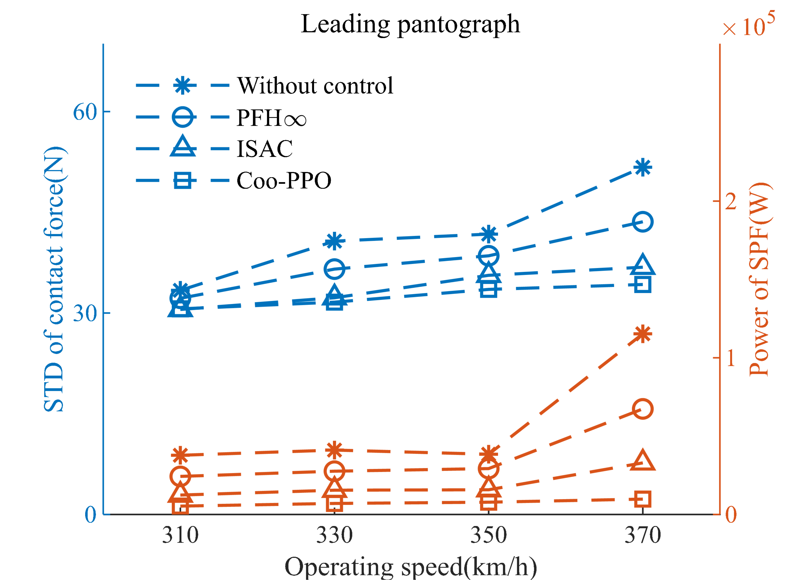

# Coo-PPO
This for the paper" A Reinforcement Learning-based Pantograph Control Strategy for Improve Contact Quality  in High-speed Railways"\
Code is under preparation, please be patient.

# Abstract
In high-speed railways, the pantograph-catenary system (PCS) is a critical subsystem of the power supply system for trains.
In particular, when the dual pantograph-catenary system (DPCS) is in operation, the passing of the leading pantograph (LP) causes the contact force of the trailing pantograph (TP) to fluctuate violently, affecting the power collection quality of the electric multiple units (EMUs).
The actively controlled pantograph is the most promising technique for reducing the pantograph-catenary contact force (PCCF) fluctuation and improving the current receiving quality. 
This study proposes a multi-agent reinforcement learning (MARL) algorithm called cooperative proximity policy optimization (Coo-PPO) based on the Nash equilibrium framework.
As the simulation environment in DRL, a non-linear DPCS model is established based on finite element mothed and multi-body dynamics theory. 
In the algorithm implementation, the agent uses an independent parameter structure to play a unique role in a cooperative environment. A novel reward propagation channel is proposed in the reward part to address the spurious rewards and "lazy agent" issues. Furthermore, a curriculum learning approach is adopted to strike a balance between reward maximization and rational movement patterns. An existing independent RL algorithm and a traditional control strategy are compared in the same scenario to validate the proposed control strategy's performance.
The experimental results show that the Coo-PPO algorithm obtains more rewards, significantly suppresses the fluctuation in PCCF (up to $41.55%$), and dramatically decreases the TP's off-line rate (up to $10.77%$).

# Results

